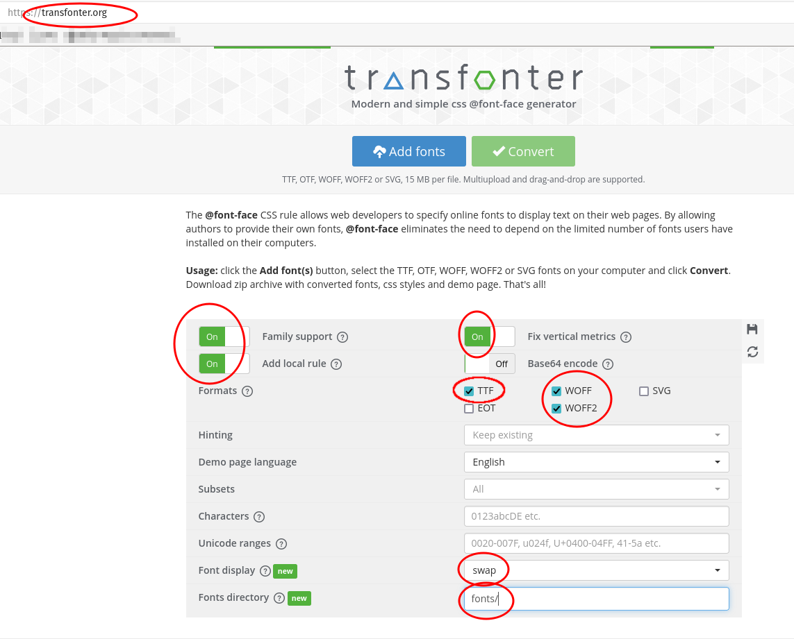

# Building a CSS Stylesheet

# Part 1: Color Palette & Typography

## Color Palette

Please go to [color.adobe.com](https://color.adobe.com) and upload an image with a color palette that you like. 

Open your CSS stylesheet from your theme, copy the color codes from the Adobe site and paste them into the stylesheet. Assign each color a CSS variable name.

From now on, only refer to colors in your CSS by their name. Over time, this will let you refine and perfect your palette.

You can use names that explain the color, or you can use names that explain the use of the color in the interface. Your choice.

### Example 1

    :root {
      --palest-blue: #D0E5F2;
      --pale-orange: #F2A679;
      --dark-orange:  #D95A2B;
      --dark-gray: #474441;
      --deep-red: #8C2D18;
    }

Or:

### Example 2

    :root {
      --main-bg-color: #D0E5F2;
      --main-fg-color: #F2A679;
      --titles-color:  #D95A2B;
      --bodytext-color: #474441;
      --accent-color: #8C2D18;
    }

## Typography

### Find a good font pair

Seek inspiration here: [Ultimate Guide to Font Pairing](https://www.canva.com/learn/the-ultimate-guide-to-font-pairing/)

Look on [fonts.google.com](https://fonts.google.com) (or on other sites where you can legally download fonts for web use) for a good font combination. Find at least two fonts:

- One font face for titles and subtitles
- One font face for body text

Download the fonts to your computer.

### Convert the fonts for web use

Go to [https://transfonter.org/](https://transfonter.org/)

Use these settings to convert your fonts to WOFF and WOFF2 formats:

### Move the font files

Move the font files into the fonts folder of your theme. (There is no need to add them into subfolders.)

### Copy the CSS @font-face rules

Copy the font face rules from the Transfonter stylesheet.css to your theme's stylesheet.

     @font-face {
    font-family: 'Anton';
    src: local('Anton Regular'), local('Anton-Regular'),
        url('fonts/Anton-Regular.woff2') format('woff2'),
        url('fonts/Anton-Regular.woff') format('woff');
    font-weight: normal;
    font-style: normal;
    font-display: swap;
    }
    
    
    
    @font-face {
      font-family: 'Raleway';
      src: local('Raleway Regular'), local('Raleway-Regular'),
          url('fonts/Raleway-Regular.woff2') format('woff2'),
          url('fonts/Raleway-Regular.woff') format('woff');
      font-weight: normal;
      font-style: normal;
      font-display: swap;
    }
    
    
    @font-face {
      font-family: 'Raleway';
      src: local('Raleway Bold'), local('Raleway-Bold'),
          url('fonts/Raleway-Bold.woff2') format('woff2'),
          url('fonts/Raleway-Bold.woff') format('woff');
      font-weight: bold;
      font-style: normal;
      font-display: swap;
    }

### Add some basic text font rules

In web typography, always have **multiple fallbacks** in case your preferred fonts do not load as expected. This means you must write "preferred font, preferred alternate font, generic alternate font".

    h1, h2, h3, h4, h5, h6, label {
      font-family: Anton, 'Helevetica Neue', Arial, sans-serif;
    }
    
    p, li, figcaption, a {
      font-family: 'Raleway Regular', 'Helevetica Neue', Arial, sans-serif;
    }

Always **limit the width of your text content** so that on very large screens your text looks like a column not one extremely wide sentence.

    p, li {
        max-width: 65ch;
    }

## Add the CacheBuster .htaccess code to your localhost and GWD web site

Copy the code from this repo: [CacheBuster .htaccess](https://raw.githubusercontent.com/JACGWD/CacheBuster/main/.htaccess) and add it to public_html/.htaccess (GWD) and htdocs/.htaccess (localhost)

Make sure to paste the code ***at the bottom*** of the .htaccess file. Do not paste the code inside another section of code.

This code will allow two (very important) things:

1. It will disable caching, which will make it easier for you to always see the latest version of your work.

## EM vs REM

An EM is a value equal to the height of a lowercase letter m in the chosen font.

An em can have different values if you are looking at the letter m in a paragraph, an H1 tag or an h4 tag. An em is ***context-sensitive***.

A REM is a "Root EM". It is a value equal to the height of a lowercase letter m in the chosen font ***of the root element***. The value of a REM never changes. 

## Typographic Scale

There is a science behind choosing fonts sizes that work well together. Very much like music, it all depends on which notes you choose to place into a chord. In the case of type, the size of glyphs is equivalent to the note in the chord.

See: [https://spencermortensen.com/articles/typographic-scale/](https://spencermortensen.com/articles/typographic-scale/)  Scroll down to the bottom and experiment with the scale selector. Notice sometimes it gives the name of a musical chord stucture.

Experiment with the R value (size contrast ratio) to different ratios (ex: 1.6 or 1.2 or 1.618), and the height of the base font F0 (body font size).

Note 1.618 is the golden ratio used in classic art. 

https://www.adobe.com/creativecloud/design/discover/golden-ratio.html

    /* ==================  EXAMPLE TYPOGRAPHIC SCALE ============================= */
    
     h1 { font-size: 3.6rem; }
     h2 { font-size: 2.9977rem; }
     h3 { font-size: 2.4961rem; }
     h4 { font-size: 2.0785rem; }
     h5 { font-size: 1.7307rem; }
     h6 { font-size: 1.4411rem; }
     p, li { font-size: 1.2rem; }
     footer { font-size: .9992rem; }
    
     /* ==================  END EXAMPLE TYPOGRAPHIC SCALE ============================= */

Copy the result into your stylesheet.

## Mobile First

The main technique for creative responsive web designs is to start with the mobile scale design first. It is the easiest because it is (mostly) a single column design.

Mobile first defines the following list of design decisions:

- Color palette
- Font choices
- Typographic scale
- Typographic white space
- Margins
- Padding
- List decoration (bullets)
- Link states (LoVeHA Rule)
- Order of content priority (most important content at the top)

## LoVeHA! Rule

The "Link Visited Hover Active"  CSS rules for links and their different states must be written in this order:

    a:link {}
    a:visited {}
    a:hover {}
    a:active {}

If not written in the order above, the effects on one or several states may not be visible.

## Add the Sidebar

With your custom theme active in Wordpress, go Appearance > Customize > Widgets > Add Block Widget > Custom HTML. Add the following HTML code:

    
This is the sidebar

You will be able to customize this at any time during the Trade Fair project.

## CSS Skeleton Design

To start off the design, it helps to be able to see the default building blocks of the page.

    header, nav, main, aside, footer {
        border: 1px solid #444;
        padding: 1rem;
        margin: 1rem;
    }
    
    header:before, nav:before, main:before, aside:before, footer:before {
        color: red; 
        position: relative; 
        top: -1.5rem; 
        left: 0; 
        background-color: #fff; 
        padding: 0.25rem; 
        border: 1px solid #444;
    }
    
    header:before {
        content: "header"; 
    }
    
    
    nav:before {
        content: "nav"; 
    }
    
    
    main:before {
        content: "main"; 
    }
    
    
    aside:before {
        content: "aside"; 
    }
    
    
    footer:before {
        content: "footer"; 
    }
    

## CSS Combinators

All of the following four links explain the same concept. You may find one easier to read than another, so pick your favourite. 

[CSS Combinators](https://www.w3schools.com/Css/css_combinators.asp) 

[Combinators - Learn web development | MDN](https://developer.mozilla.org/en-US/docs/Learn/CSS/Building_blocks/Selectors/Combinators) 

http://tutorialspark.com/css3/CSS_Combination_Selector.php 

[24 CSS Selectors - Combination Selectors , Multiple Selectors - Bizanosa](https://bizanosa.com/24-css-selectors-combination/) 

## Body Padding vs Child Margins

One of the first decisions that must be taken is <u>whether or not you want the background colors of the content to reach the edge of the browser window</u>. In that case, do not give the body any padding.

## Wrapper DIV

One of the most useful **non-semantic elements** (an element not used to define the structure of the text content) is a box that wraps all the page content. Hence, we call it a "wrapper".

### header.php

In the header.php file of your theme, add the opening of the div immediately after the opening of the body tag:

    <body <?php body_class(); ?>>
        
    

    <?php // CONTAINER DIV OPENS HERE / CLOSES IN FOOTER.PHP  ?>

### footer.php

In the footer.php file of your theme, add the closing of the div immediately before the closing of the body tag:

    

    <?php // CONTAINER DIV ENDS HERE ?> 
    
    
    </body>

## Typographic Margins

### Vertical rhythm (margins)

Define the amount of vertical margin for each type of text content. There should always be more space above than below an item.

Example:

    h2 {
      margin-top: 3rem;
      margin-bottom: 1.5rem;
    }

### Horizontal Rhythm (indents)

Indenting certains types of information, *most notably lists,* helps the reader understand under which heading a certain piece of information belongs. If everything was left aligned to the left margin all the time, texts would be harder to understand untuitively.

    ul, ol {
      margin-left: 2rem;
    }

## Element Pairing

Fine typography depends on adjusting the spacing in between specific pairs of elements. For example, the spacing between an H1 and a paragraph is not the same as an H1 followed by an H2. 

We use CSS Combinator selectors for this.

    H1 + p {}   /* Paragraph immediately after an H1  */

    h1 + h2 {}  /* H2 immediately after an H1 */

    p + ul {}  /* Unordered list immediately after a paragraph  */

    ul + p {}  /* Paragraph immediately after an unordered list  */

    section > h2 {}  /* H2 immediately inside a section tag  */

## Sectional Margins

Separate the different sections of the page with generous amounts of white space. 

Negative space will help the reader understand that a certain section of the page is different from others because it appears "alone" in its area. This will let you avoid having to place boxes, borders and backgrounds just to make the area (for example: header) stand out.

      header {
        margin-bottom: 5em;
      }
    
      main {margin: 3em 0 4em 0;}  
      /* CSS shorthand: clockwise starting at noon */
    
      footer {
        margin-top: 5em;
      }

## HTML Element Pseudo-elements

::before and ::after pseudo-elements can be added to any HTML element. They are often used as content boxes to hold background images or typographic characters.

    blockquote::before {
      content: '"';
      display: block;
      font-family: Times, serif;
      font-size: 72px;
      height: 40px;
      width: 50px;
      color: red;
      position: absolute;
      top: -0.3em;
      left: 0;
      border: 1px solid red;
    }

## Prepare for larger viewport designs

Set the wrapper div to be centered and with a fixed width on larger viewports.

    @media screen and (min-width: 1025px) {
        
     .main-container {
        margin: 3em auto;  
       /* 3em can be any value; auto L/R margins do the actual centering */
        width: 960px;
     }  
    }